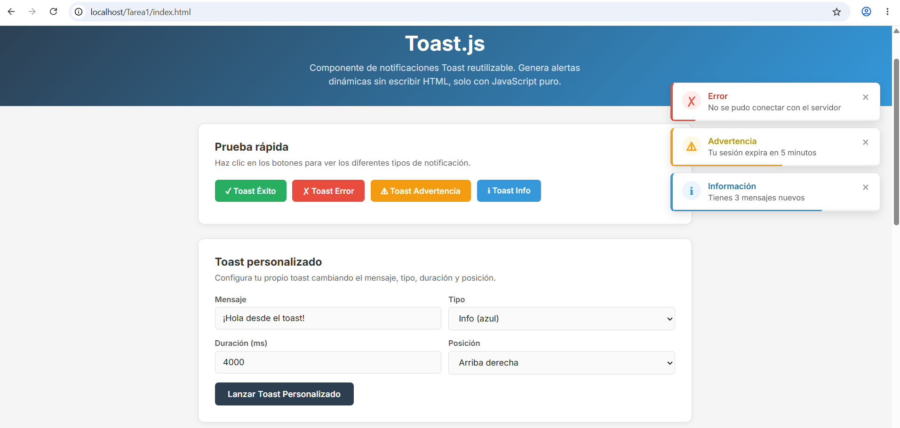

# Toast.js - Componente de Notificaciones

Por: Manuel de Jesus Matias Carreño
Matricula: 22161159

Componente visual reutilizable de notificaciones Toast hecho con JavaScript puro. Genera alertas dinámicas sin escribir HTML, todo se crea desde JS.

## Qué problema resuelve

Cuando necesitas mostrar mensajes al usuario (éxito, error, advertencia, info) normalmente tienes que escribir HTML para cada mensaje y manejar su visibilidad. Este componente lo hace automáticamente: solo llamas una función y el toast aparece con animación, barra de progreso, y se cierra solo.

## Instalación

Solo agrega estos 2 archivos en tu HTML:

```html
<link rel="stylesheet" href="css/componente.css">
<script src="js/componente.js"></script>
```

No necesitas instalar nada más. No usa frameworks.

## Uso con ejemplos de código

### Atajos rápidos

```javascript
// toast de exito (verde)
toastExito("¡Datos guardados correctamente!");

// toast de error (rojo)
toastError("No se pudo conectar con el servidor");

// toast de advertencia (naranja)
toastAdvertencia("Tu sesión expira en 5 minutos");

// toast informativo (azul)
toastInfo("Tienes 3 mensajes nuevos");
```

### Con todas las opciones

```javascript
crearToast({
    mensaje: "Tu sesión expira pronto",
    tipo: "warning",
    duracion: 5000,
    posicion: "abajo-derecha"
});
```

### Con duración personalizada

```javascript
// toast que dura 8 segundos
toastExito("Guardado", 8000);

// toast que dura 2 segundos
toastInfo("Cargando...", 2000);
```

## Parámetros

| Parámetro | Tipo | Default | Descripción |
|-----------|------|---------|-------------|
| mensaje | string | "Notificación" | El texto que muestra el toast |
| tipo | string | "info" | Cambia el color: success, error, warning, info |
| duracion | number | 4000 | Cuántos ms dura visible |
| posicion | string | "arriba-derecha" | Dónde aparece en la pantalla |

### Posiciones disponibles

- `"arriba-derecha"` - Esquina superior derecha (default)
- `"arriba-izquierda"` - Esquina superior izquierda
- `"abajo-derecha"` - Esquina inferior derecha
- `"abajo-izquierda"` - Esquina inferior izquierda

## Características

- Se genera dinámicamente con JS, sin HTML manual
- 4 tipos con colores distintos (éxito, error, advertencia, info)
- Barra de progreso animada que muestra cuánto falta para cerrarse
- Botón de cerrar manual (la X)
- Se puede cambiar la posición en las 4 esquinas
- Animación de entrada y salida
- Se pueden apilar varios toasts a la vez
- Responsive en pantallas chicas

## Estructura del proyecto

```
/Tarea1
├── README.md
├── index.html
├── css/
│   └── componente.css
├── js/
│   └── componente.js
└── img/
```

## Capturas de pantalla



## Autor

Manuel Matias - 2026
